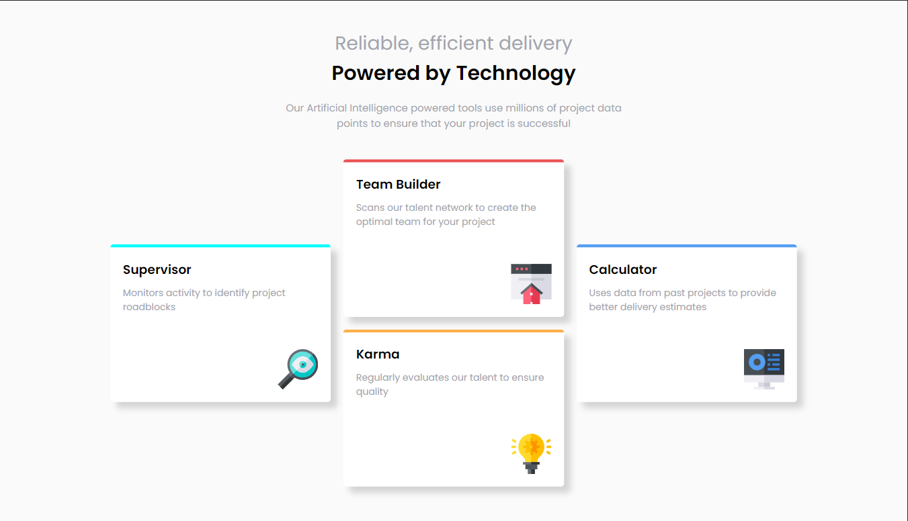
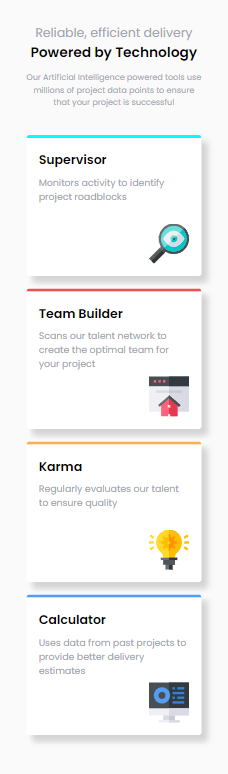

# Frontend Mentor - Four card feature section solution

This is a solution to the [Four card feature section challenge on Frontend Mentor](https://www.frontendmentor.io/challenges/four-card-feature-section-weK1eFYK). Frontend Mentor challenges help you improve your coding skills by building realistic projects. 

## Table of contents

- [Overview](#overview)
  - [The challenge](#the-challenge)
  - [Screenshot](#screenshot)
  - [Links](#links)
- [My process](#my-process)
  - [Built with](#built-with)
  - [What I learned](#what-i-learned)
  - [Continued development](#continued-development)
- [Author](#author)

**Note: Delete this note and update the table of contents based on what sections you keep.**

## Overview

### The challenge

Users should be able to:

- View the optimal layout for the site depending on their device's screen size

### Screenshot

### Links

- Solution URL:  [Solution](https://www.frontendmentor.io/solutions/fourcardfeaturesection-using-flex-and-grid-f78tf2v-24)
- Live Site URL:  [Live site](https://ahmadikhdair.github.io/Four-card-feature-section/)

## My process

### Built with

- Semantic HTML5 markup
- CSS custom properties
- Flexbox
- CSS Grid

### What I learned

Improved my skills using flexbox and grid for the responsiveness of the webpage. Got much better at designing and adding small details like shadows to my cards to make the webpage look more decorated.

### Continued development

I want to continue focusing on making the webpages responsive to all screen sizes. It has been a struggle for me learning how to do so but surely getting the hang of it.

## Author

- LinkedIn - [Ahmad Ikhdair](https://www.linkedin.com/in/ahmad-ikhdair/)
- Frontend Mentor - [AhmadIkhdair](https://www.frontendmentor.io/profile/AhmadIkhdair)

